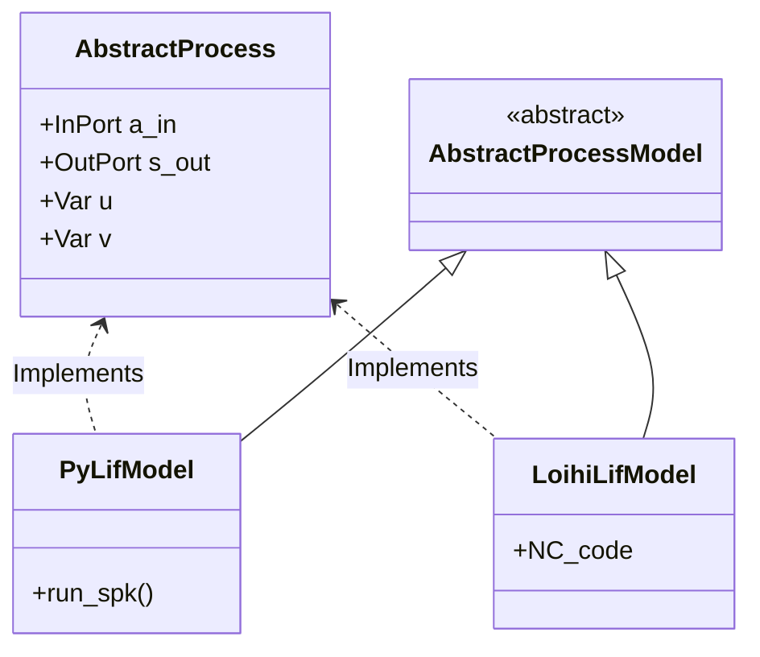

# Lava Neuromorphic Framework: Architectural Structures & Best Practices

This document outlines the core structural patterns and development best practices for building Spiking Neural Network (SNN) applications using the **Lava** neuromorphic programming framework. The insights and relationships presented below are extracted from the Lava tutorials and codebase, structured in alignment with the `graphify` knowledge graph analysis.

---

## 1. The Separation of Interface (Process) and Behavior (ProcessModel)

The defining paradigm of Lava is the strict separation of **what** a component does (its interface) from **how** it does it (its execution model).



### Best Practices:
* **Decouple Interfaces**: Always inherit from [AbstractProcess](file:///home/raresh/Projects/lava/src/lava/magma/core/process/process.py) to define your custom computational unit. Only declare ports (`InPort`, `OutPort`) and state variables (`Var`) in the `__init__` constructor.
* **Keep Processes Agnostic**: Never write execution code (e.g., NumPy array math, loop iterations) inside a `Process` class. The `Process` must remain fully agnostic of whether it will run on a CPU, GPU, or Loihi hardware.
* **Define Backend-Specific Models**: Inherit from language-specific model classes (e.g., `PyLoihiProcessModel` for Python CPU models) and decorate them using `@implements(proc=YOUR_PROCESS, protocol=LoihiProtocol)`.

---

## 2. Leaf vs. Hierarchical ProcessModels

Lava supports two types of `ProcessModels` for executing process dynamics:

| Model Class | Type | Purpose | Composition |
| :--- | :--- | :--- | :--- |
| **`LeafProcessModel`** | Low-Level | Directly implements numerical and spike-state integration. | Written in Python (NumPy) or C. |
| **`SubProcessModel`** | Hierarchical | Composes complex behaviors by wiring primitive processes. | Consists of other child processes. |

### LeafProcessModel Pattern
A Python CPU Leaf model (`PyLoihiProcessModel`) defines typed variables and implements `run_spk()`:

```python
from lava.magma.core.decorator import implements, requires, tag
from lava.magma.core.resources import CPU
from lava.magma.core.model.py.model import PyLoihiProcessModel
from lava.magma.core.model.py.ports import PyInPort, PyOutPort
from lava.magma.core.model.py.type import LavaPyType

@implements(proc=LIF, protocol=LoihiProtocol)
@requires(CPU)
@tag('floating_pt')
class PyLifModel(PyLoihiProcessModel):
    a_in: PyInPort = LavaPyType(PyInPort.VEC_DENSE, float)
    s_out: PyOutPort = LavaPyType(PyOutPort.VEC_DENSE, bool, precision=1)
    u: np.ndarray = LavaPyType(np.ndarray, float)
    v: np.ndarray = LavaPyType(np.ndarray, float)
    
    def run_spk(self):
        # Read incoming spikes/activations
        a_in_data = self.a_in.recv()
        # Integrate synaptic current and membrane voltage
        self.u[:] = self.u * (1 - self.du) + a_in_data
        self.v[:] = self.v * (1 - self.dv) + self.u + self.bias
        # Check threshold & reset
        s_out = self.v >= self.vth
        self.v[s_out] = 0.0
        # Transmit output spikes
        self.s_out.send(s_out)
```

### SubProcessModel (Hierarchical) Pattern
Use a hierarchical model (`AbstractSubProcessModel`) to build structured neural layers (e.g., coupling a synaptic `Dense` projection with `LIF` neurons) without writing low-level loop code:

```python
from lava.magma.core.model.sub.model import AbstractSubProcessModel

@implements(proc=DenseLayer, protocol=LoihiProtocol)
class SubDenseLayerModel(AbstractSubProcessModel):
    def __init__(self, proc):
        # 1. Instantiate child processes using parameters from parent proc
        shape = proc.proc_params.get("shape")
        self.dense = Dense(weights=proc.proc_params.get("weights"))
        self.lif = LIF(shape=(shape[0],), vth=proc.proc_params.get("vth"))
        
        # 2. Wire ports: parent inputs -> child inputs -> child outputs -> parent outputs
        proc.in_ports.s_in.connect(self.dense.in_ports.s_in)
        self.dense.out_ports.a_out.connect(self.lif.in_ports.a_in)
        self.lif.out_ports.s_out.connect(proc.out_ports.s_out)
        
        # 3. Alias variables to expose inner states through the parent Process API
        proc.vars.v.alias(self.lif.vars.v)
        proc.vars.weights.alias(self.dense.vars.weights)
```

### Best Practices:
* **Promote Reuse**: Prefer writing a `SubProcessModel` to bundle existing components (like `Dense` + `LIF`) over writing large, flat, custom `LeafProcessModels`. This allows the runtime compiler to dynamically choose the best backend for each submodule.
* **Decouple Variable Types**: SubProcessModels do not specify types or precisions (like `LavaPyType`) for their parent variables. The precision is automatically determined by the selected sub-models during execution setup.

---

## 3. Communication: Ports and Channels

Lava processes communicate strictly via asynchronous message passing on channels.

```
+-------------+                    +-------------+
|  Process A  |                    |  Process B  |
|  [OutPort]  |=====( Channel )===>|  [InPort]   |
+-------------+                    +-------------+
```

### Best Practices:
* **No Shared State**: Never read or modify the `Var` of another process directly at runtime (e.g., calling `proc_a.v = 10` while running). This creates side effects and breaks compilation on multi-node or neuromorphic hardware.
* **Always use `connect()`**: Setup connections between processes explicitly in your top-level orchestrator:
  ```python
  layer_0.s_out.connect(layer_1.s_in)
  ```
* **Use Remote Memory Access (RMA) Sparingly**: If a process absolutely needs direct access to variables inside another process (e.g., reading weight variables for updates), use `RefPort` and `VarPort` (Remote Memory Access). Remember that RMA is constrained by hardware bandwidth on neuromorphic chips.

---

## 4. Execution Lifecycle & Runtime Control

Execution is controlled by compiling processes into a runtime graph using a `RunConfig` and running them under specific `RunConditions`.

```python
from lava.magma.core.run_configs import Loihi1SimCfg
from lava.magma.core.run_conditions import RunSteps

# Instantiate network
network = DenseLayer(shape=(10, 10), vth=15)

# Setup runtime configuration selecting Python floating point backend
run_cfg = Loihi1SimCfg(select_tag='floating_pt', select_sub_proc_model=True)

# Run for 100 time steps
network.run(condition=RunSteps(num_steps=100), run_cfg=run_cfg)

# Retrieve internal states safely after simulation pauses
current_voltages = network.v.get()

# Stop execution and clean up resources
network.stop()
```

### Best Practices:
* **Call `stop()`**: Always call `network.stop()` at the end of your script. Failing to do so leaves daemon execution threads running in the background.
* **Control with Tags**: Use the `select_tag` argument in your `RunConfig` to easily toggle between different precisions (e.g., `floating_pt` for prototyping vs. `fixed_pt` or `bit_acc` for hardware deployment validation).

---

## 5. Neuromorphic Hardware Considerations (Loihi Compliance)

To transition models smoothly from classical computers to Loihi neuromorphic chips:

* **Fixed-Point Scaling**: Loihi operates on fixed-point arithmetic (e.g., 24-bit state, 8-bit weight values). Ensure you implement a bit-accurate process model (typically suffixed with `BitAcc`) where variables are scaled by power-of-two shifts (e.g., `bias = bias_mant * 2**bias_exp`).
* **Match Simulation Paradigms**: Verify floating-point simulation results against bit-accurate, hardware-compliant models. Discrepancies usually stem from fixed-point overflows or rounding errors.
* **Observe Synaptic Weights Storage**: Neuromorphic synapses are limited in storage precision. Always quantize weights into integer ranges (e.g., `-128` to `127` for 8-bit) before compiling for the neurocores.

---

## 6. Spiking Learning Rules (STDP & Custom Rules)

Spike-Timing Dependent Plasticity (STDP) in Lava relies on generating post-synaptic traces and using custom learning rules:

* **Differentiate Traces**: Ensure that learning rules process spike history as continuous traces (e.g. using `SpikeTraces`).
* **Modular Modulation (Three-Factor Learning)**: When designing modulated rules (e.g., Reward-Modulated STDP), separate the third factor (reward/dopamine) into a dedicated process port. The learning rule model must listen on this port to scale the weight updates computed by local pre/post spikes.
